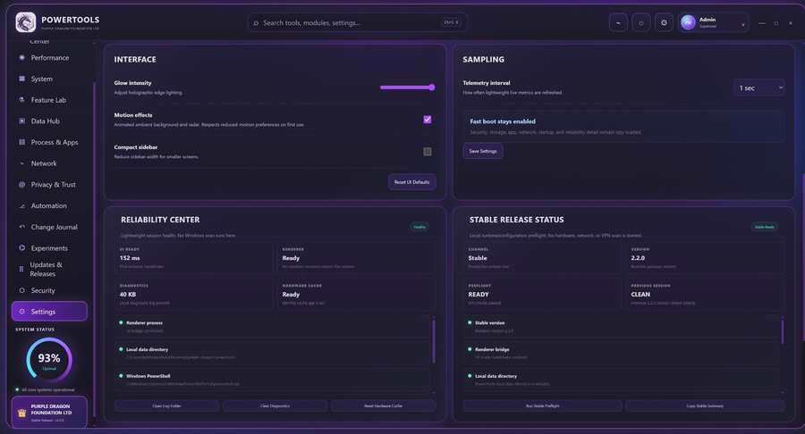

# Purple Dragon PowerTools v2.5.0 — Clear Status & Notifications

Purple Dragon PowerTools is a Windows Electron system utility and AI command center by **Purple Dragon Foundation Ltd**.

`v2.5.0` is the current **Stable public release** of Purple Dragon PowerTools. It includes Interface Cleanup, Navigation & Quick Actions, Workspace Memory, and Clear Status & Notifications, alongside the existing cryptographic release verification and guarded signed publishing pipeline.

Download the [v2.5.0 Stable release](https://github.com/bubblegump30/PurpleDragonPowerTools/releases/tag/v2.5.0).

`v2.1.0` remains the first Stable public-release milestone, with `v2.1.0-rc.1` retained as the earlier public release-candidate record.

## Upcoming hotfix: v2.5.1 — Status Refresh Hotfix

The source includes the fix for telemetry/process status banners flashing on every sample. Routine status timestamps update at most every 30 seconds; failures and recovery remain immediate. v2.5.0 remains the published download until the v2.5.1 publishing workflow succeeds.

## Latest release: v2.5.0 — Clear Status & Notifications

This release adds shared read-status indicators for core centers, checked/last-success timestamps, and read-only retry actions. Process/app inventory failures retain the last successful snapshot with an explicit stale-data message.

The notification button opens a session-only history (up to 50 messages), with unread count, severity labels, dismissal, and clear-history controls. Settings includes persistent Quiet Mode for routine in-app/Windows popups and a separate routine in-app popup switch. Errors remain visible. Suppressed automation notifications remain recorded, and desktop notification messages are forwarded to the session center when the renderer is connected. Existing release-specific notification settings still apply.

The signed publication workflow completed successfully, including Windows installer/portable builds and published metadata verification. Native Windows notification behavior, UAC states, high-DPI visuals, and installation/upgrade acceptance remain unverified. This release includes the merged v2.2.1–v2.4.0 improvements.

## Release status

- Version: **2.5.0**
- Release channel: **Stable / Latest**
- Platform: **Windows x64**
- Runtime: **Electron 44.2.0**
- Stable public release: **Published**
- Git tag: **v2.5.0**
- Git tag signing: **Verified (SSH signature)**
- Release integrity: **SHA-256 + signed release manifest + detached SSH signature**
- Windows executable signing: **Pending (unsigned binaries)**
- License: **MIT**

## Screenshots

### Command Center dashboard


### Settings, Reliability Center & Stable Release Status



## Stable release foundation

The v2.1.0 stable release is built on:

- clean Windows installation and portable packaging
- dependency and build reproducibility
- Electron privilege-boundary review
- sanitized diagnostics and logs
- graceful unsupported-hardware states
- administrator/UAC handling
- GitHub issue and release infrastructure
- installer/portable smoke testing
- SHA-256 release checksums
- explicit documentation of unsigned-build limitations until code signing is available

See [PUBLIC_RELEASE_READINESS.md](PUBLIC_RELEASE_READINESS.md) for the completed v2.1.0 readiness record and [SECURITY.md](SECURITY.md) for security-reporting guidance.

## VPN Center

The existing VPN Center supports guarded integration with installed NordVPN and ExpressVPN Windows clients.

- Detects installed NordVPN and ExpressVPN clients only when Network PowerTools opens or is manually refreshed.
- Shows installed, running, provider CLI, and active VPN-adapter state.
- Opens an installed provider client or its official setup page.
- Offers Quick Connect through a detected provider CLI.
- Confirms every Disconnect request and warns that the public route or kill switch may change.
- Requests Windows administrator approval for ExpressVPN command-line connection control when required by the provider.
- Does not store VPN usernames, passwords, activation codes, provider tokens, or server history.
- Keeps discovered executable paths and Start-menu IDs inside Electron's main process.

Connection state is derived from local Windows process and adapter inventory. If a provider changes its adapter naming or does not expose a usable CLI, use the official provider client as the authoritative connection interface.

## AI Command Center

The **AI Command Deck** supports three execution modes:

- **Direct Model** — send to the currently selected local or configured cloud model.
- **Dragon Router** — use transparent local heuristics to choose an eligible model.
- **Dragon Council** — run the same mission across selected models and compare their independent responses.

Mission profiles include PC diagnostics, Windows troubleshooting, coding/development, defensive security review, and deep analysis.

System-Aware AI can attach a redacted snapshot built from live telemetry plus already-loaded modules. Cloud system context remains separately opt-in.

The Command Center is **review-first**: AI responses do not directly execute Windows changes, process actions, cleanup, PowerShell, GitHub writes, or Feature Lab mutations.

## Storage and hardware

Storage & Data Hub supports multi-drive inventory and derives used bytes and usage percentage from authoritative capacity/free-space values. Local fixed/removable disks can include HDD, SATA SSD, NVMe, and USB storage. Network shares and optical drives are excluded from local capacity totals.

Unsupported or inaccessible telemetry should be reported as unavailable/unsupported rather than represented as a synthetic zero value.

## Privacy and startup behavior

- API credentials use Electron `safeStorage`; there is no intended plaintext credential fallback.
- Local custom AI endpoints are limited to loopback addresses.
- Cloud providers are contacted only when explicitly configured and used.
- System-Aware context removes sensitive fields defined by the context builder.
- Command Center mission history exists only in renderer memory for the current session.
- AI provider discovery is lazy and does not run on the startup-critical path.
- VPN client discovery is lazy and does not run on the startup-critical path.

## Major centers

Purple Dragon PowerTools currently includes the Dashboard, AI Command Center, Performance & Hardware, System PowerTools, Windows Feature Lab, Storage & Data Hub, Process & Apps, Network PowerTools, Privacy & App Trust Intelligence, Automation Engine, Change Journal + Undo, Experiments, Update & Release Center 2.0, Security Center, Reliability controls, AI Provider Hub, Dragon Router, Dragon Council, and System-Aware AI.

## Run from source

Requirements:

- Windows 11 recommended
- Node.js 22 or later
- PowerShell
- Internet access for initial dependency installation

```powershell
Set-ExecutionPolicy -Scope Process Bypass
.\scripts\run.ps1
```

The normal launcher keeps launch-time dependencies separate from packaging dependencies.

## Build Windows packages

```powershell
.\scripts\build-windows.ps1
```

Expected release outputs are created under `dist/`.

## Security reports

Read [SECURITY.md](SECURITY.md) before reporting a vulnerability. Never post passwords, API keys, tokens, private keys, activation codes, or unsanitized diagnostic data in a public issue.

## License

Purple Dragon PowerTools is released under the **MIT License**. See [LICENSE](LICENSE).
